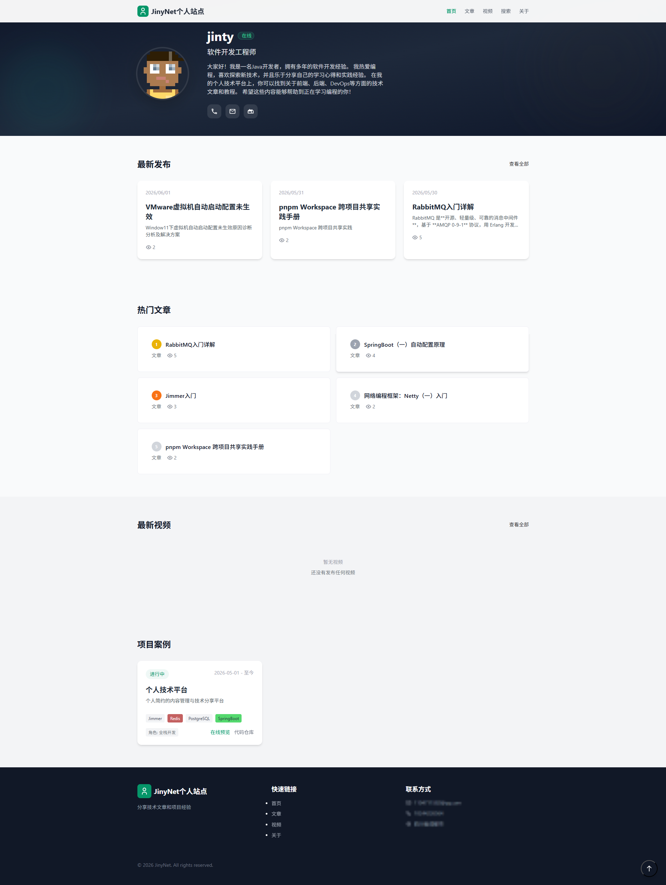
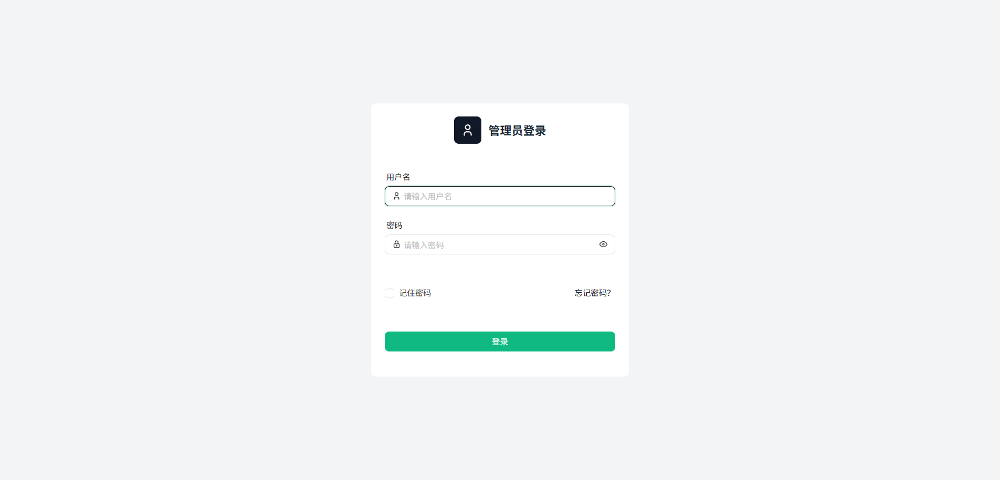
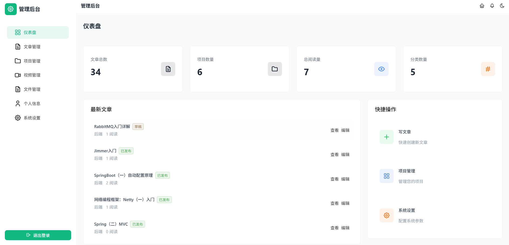
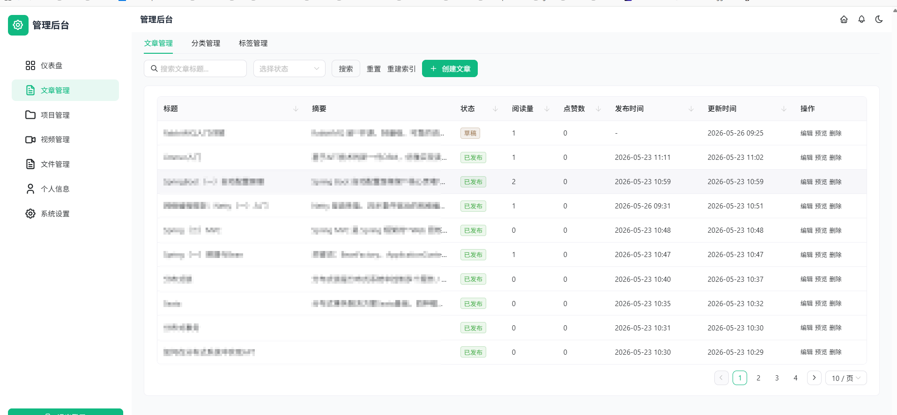
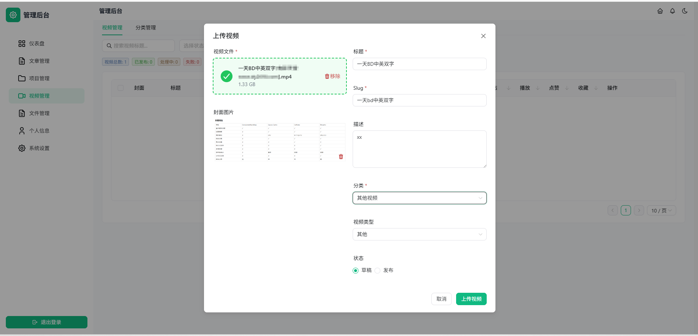
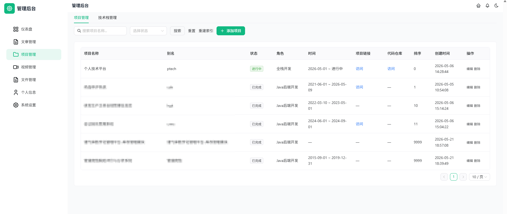
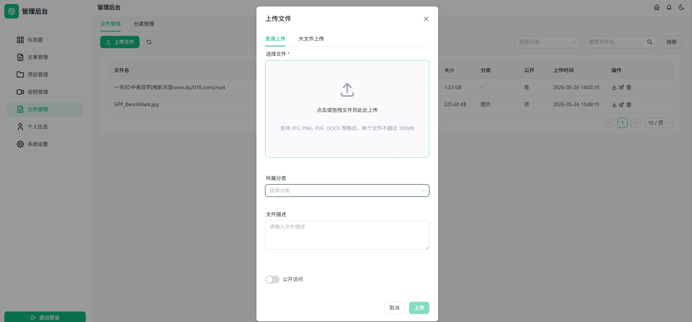
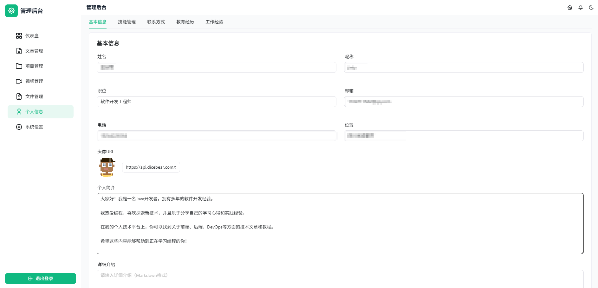
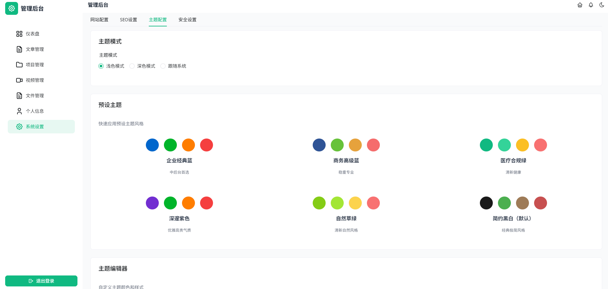

<p align="center">
  <h1 align="center">jinynet-ptech</h1>
  <p align="center"><strong>个人技术平台</strong> — 技术文章、项目展示、视频分享的一站式个人站点</p>
</p>

<p align="center">
  
  
  
  
  
  
  
  
</p>

---

## 📖 项目简介

jinynet-site 是我的个人技术平台。支持技术博客发布、项目案例展示、视频分享与播放、全文检索等功能，同时提供完整的后台管理系统。

### ✨ 核心特性

- **📝 技术博客** — Markdown 编辑器（Vditor），支持草稿/发布、分类标签管理
- **🚀 项目案例** — 展示个人项目经历，关联技术栈，图文并茂
- **🎬 视频管理** — 大文件分片上传（支持断点续传、秒传）、HLS 流媒体播放、自动转码
- **🔍 全文检索** — 基于 Lucene 10.4 + SmartCN 中文分词，支持文章/项目全局搜索与关键词高亮
- **📁 文件管理** — 统一文件上传/预览/分类，支持多存储后端
- **👤 个人信息** — 技能、教育经历、工作经验、联系方式全维度展示
- **📊 仪表盘** — 数据统计概览，站点运行状况一目了然
- **🔐 安全认证** — 基于 Sa-Token 的 RBAC 权限管理，滑块验证码、密码错误限制
- **🌗 主题切换** — Naive UI 驱动的明暗双主题
- **🐳 容器化部署** — 完整的 Docker Compose 编排，生产级 systemd 服务脚本

---

## 🖼️ 截图预览

### 前台

| 首页 | 管理登录 |
| :---: | :---: |
|  |  |

### 后台管理

| 仪表盘 | 文章管理 |
| :---: | :---: |
|  |  |

| 视频管理 | 项目管理 |
| :---: | :---: |
|  |  |

| 文件管理 | 个人信息 |
| :---: | :---: |
|  |  |

| 主题配置 |
| :---: |
|  |

---

## 🛠️ 技术栈

### 前端

| 技术 | 版本 | 说明 |
| :--- | :--- | :--- |
| Vue | 3.5.x | 渐进式 JavaScript 框架 |
| Vite | 6.x | 下一代前端构建工具 |
| TypeScript | 5.8.x | 类型安全 JavaScript 超集 |
| Naive UI | 2.44.x | Vue 3 组件库 |
| Pinia | 3.x | Vue 3 状态管理 |
| Vue Router | 5.x | 官方路由管理器 |
| UnoCSS | 0.65.x | 原子化 CSS 引擎 |
| Axios | 1.15.x | HTTP 请求库 |
| Vditor | 3.11.x | Markdown 编辑器 |
| pnpm | — | 包管理器 |

### 后端

| 技术 | 版本     | 说明 |
| :--- |:-------| :--- |
| Java | 21     | JDK LTS 版本 |
| Spring Boot | 3.5.x  | 企业级 Java 框架 |
| Jimmer | 0.10.7 | 类型安全 ORM，关联查询自动优化 |
| PostgreSQL | ≥ 16   | 关系型数据库 |
| Redis | ≥ 7    | 缓存/会话存储 |
| Lucene | 10.4.x | 全文检索引擎 |
| Sa-Token | —      | 轻量级认证授权框架 |
| X-File-Storage | —      | 文件存储抽象层 |
| Maven | —      | 项目构建工具 |

---

## 📁 项目结构

```
jinynet-ptech/
├── site-webui/                      # Vue 3 前端项目
│   ├── src/
│   │   ├── api/                     # API 接口封装
│   │   ├── components/              # 公共组件
│   │   │   ├── admin/               # 后台管理组件
│   │   │   └── frontend/            # 前台展示组件
│   │   ├── composables/             # 组合式函数
│   │   ├── icons/                   # 图标导出
│   │   ├── router/                  # 路由配置
│   │   ├── stores/                  # Pinia 状态管理
│   │   ├── utils/                   # 工具函数
│   │   └── views/                   # 页面组件
│   │       ├── admin/               # 后台管理页面
│   │       └── frontend/            # 前台展示页面
│   ├── vite.config.ts               # Vite 构建配置
│   ├── uno.config.ts                # UnoCSS 配置
│   └── package.json
│
├── site-server/                     # Spring Boot 后端项目
│   ├── src/main/java/cn/jinynet/site/
│   │   ├── SiteApplication.java     # 启动类
│   │   ├── api/                     # API 接口层
│   │   │   ├── admin/               # 后台管理接口
│   │   │   └── home/                # 前台公开接口
│   │   ├── config/                  # 配置类
│   │   ├── service/                 # 业务逻辑层
│   │   ├── handler/                 # 登录/验证处理器
│   │   ├── cache/                   # 缓存层
│   │   ├── entity/                  # 数据实体（Jimmer）
│   │   └── types/                   # 类型定义
│   │       ├── enums/               # 枚举类
│   │       └── request/             # 请求参数
│   ├── Dockerfile                   # 多阶段构建镜像
│   ├── .dockerignore
│   └── pom.xml
│
├── docs/
│   ├── screenshots/                 # 项目截图
│   ├── design/                      # 设计文档
│   │   ├── 01-项目说明.md
│   │   ├── 02-需求清单.md
│   │   ├── 03-功能接口清单.md
│   │   ├── 04-数据结构清单.md
│   │   └── 05-schema.sql            # 数据库初始化脚本
│   ├── deploy/                      # 部署相关
│   │   ├── docker-compose.yml       # Docker 编排
│   │   ├── nginx.conf               # Nginx 参考配置
│   │   ├── start.sh                 # 启动脚本
│   │   └── sitejar.service          # Systemd 服务文件
│   └── reference/                   # 参考资料
│
└── .gitignore
```

---

## 🚀 快速开始

### ⚠️ 前置依赖：安装 jinynet-infra

本项目依赖 `jinynet-infra`（提供统一的依赖管理、基础组件 Starter 和公共配置），**在构建本项目和后端Docker镜像之前，必须先将 `jinynet-infra` 安装到本地 Maven 仓库**：

```bash
# 1. 克隆父项目（与 jinynet-site 同级目录）
git clone <jinynet-infra 仓库地址> ../jinynet-infra

# 2. 安装到本地 Maven 仓库
cd ../jinynet-infra
mvn clean install -DskipTests
```

> `jinynet-infra` 包含以下核心模块：
> - `jinynet-dependencies` — 统一 BOM 依赖管理
> - `jinynet-starters` — 启动器集合（starter-jimmer / starter-web / starter-redis / starter-captcha / starter-file / starter-rbac / starter-lucene）
> - `jinynet-config` — 公共配置模块

### 环境要求

| 组件 | 版本要求 | 说明 |
| :--- | :--- | :--- |
| Node.js | ≥ 18.x | 前端开发/构建 |
| Java | ≥ 21 | 后端运行环境 |
| Maven | ≥ 3.9 | 后端构建 |
| pnpm | ≥ 8.x | 前端包管理器 |
| PostgreSQL | ≥ 16.x | 数据库 |
| Redis | ≥ 7.x | 缓存/会话存储 |

### 1. 启动后端

```bash
cd jinynet-site/site-server

# 开发环境（active profile: dev）
mvn spring-boot:run

# 生产环境（active profile: prod）
mvn spring-boot:run -Pprod

# 构建可执行 JAR
mvn clean package -DskipTests
java -jar target/site-server.jar
```

默认启动端口：`8080`

### 2. 启动前端

```bash
cd cd jinynet-site/site-webui

# 安装依赖
pnpm install

# 启动开发服务器
pnpm dev
```

默认开发端口：`5173`（Vite 默认），可通过 `.env` 文件自定义。

前端开发服务器默认以 **pnpm workspace** 模式运行，依赖同仓库中的 `packages/webui-comm` 公共前端包。

### 3. 初始化数据库

执行 `docs/design/05-schema.sql` 初始化数据库结构。
后续更新只需通过flyway配置脚本即可。

---

## 🐳 Docker 部署

项目提供完整的 Docker 容器化方案，包含前端 Nginx、后端 Spring Boot、PostgreSQL、Redis 四个服务。

```bash
# 进入部署目录
cd docs/deploy

# 构建镜像并后台启动所有服务
docker compose up -d --build

# 查看服务状态
docker compose ps

# 查看日志
docker compose logs -f

# 停止所有服务
docker compose down
```

| 服务 | 端口 | 说明 |
| :--- | :--- | :--- |
| frontend | 80, 443 | Nginx 前端（支持 HTTPS） |
| backend | 8080 | Spring Boot 后端 |
| postgres | 5432 | PostgreSQL 数据库 |
| redis | 6379 | Redis 缓存 |

> **Docker 构建注意事项**：后端 Dockerfile 使用多阶段构建（Maven + JRE），构建前需确保 `jinynet-infra` 已安装到本地 Maven 仓库。如远程仓库可用，则无需额外操作。

---

## ⚙️ 配置说明

### 后端配置

主要配置文件位于 `site-server/src/main/resources/`：

| 文件 | 说明 |
| :--- | :--- |
| `application.yml` | 通用配置 |
| `application-dev.yml` | 开发环境配置 |
| `application-prod.yml` | 生产环境配置（Git 忽略） |

核心配置项：

```yaml
# 数据库
spring:
  datasource:
    url: jdbc:postgresql://localhost:5432/site
    username: your_username
    password: your_password

  # Redis
  redis:
    host: localhost
    port: 6379
    password: your_redis_password

# Lucene 全文检索索引路径
lucene:
  index:
    path: ./lucene/index
```

### 前端配置

前端使用环境变量配置，在 `ptech-frontend/` 目录下创建：

| 文件 | 说明 |
| :--- | :--- |
| `.env` | 开发环境变量 |
| `.env.production` | 生产环境变量（Git 忽略） |

核心变量：

```env
VITE_API_BASE_URL=http://localhost:8080
```

---

## 📚 功能清单

### 前台功能

| 页面 | 功能 |
| :--- | :--- |
| 首页 | 导航栏、最新发布、热门文章、项目案例、个人简介 |
| 文章列表 | 分页展示、分类筛选、标签筛选 |
| 文章详情 | Markdown 渲染、代码高亮、相关推荐 |
| 视频列表 | 分页展示、分类筛选、播放量排序 |
| 视频播放 | HLS 流媒体播放、点赞/收藏、播放统计 |
| 全文搜索 | 文章/项目全局搜索、关键词高亮、相关度排序 |
| 关于页面 | 个人介绍、技能展示、教育经历、工作经历、联系方式 |

### 后台管理功能

| 模块 | 功能 |
| :--- | :--- |
| 仪表盘 | 文章/项目/视频/文件统计数据概览 |
| 文章管理 | 增删改查、草稿/发布、Markdown 编辑器、分类管理、标签管理 |
| 视频管理 | 增删改查、大文件分片上传（断点续传/秒传）、视频转码、封面提取 |
| 项目管理 | 增删改查、技术栈管理 |
| 文件管理 | 上传/删除/预览/分类管理、文件搜索 |
| 个人信息 | 基本信息、技能、联系方式、教育经历、工作经验 |
| 系统设置 | 网站配置、SEO 设置、安全设置 |
| 认证 | 密码登录、滑块验证码、密码错误次数限制 |

---

## 🔧 Systemd 自动启动

Linux 服务器环境下可使用 systemd 实现后端服务开机自启：

```bash
# 1. 部署 service 文件和启动脚本
sudo cp docs/deploy/sitejar.service /etc/systemd/system/
sudo mkdir -p /opt/apps/jar
sudo cp docs/deploy/start.sh /opt/apps/jar/start.sh
sudo chmod +x /opt/apps/jar/start.sh

# 2. 启用并启动服务
sudo systemctl daemon-reload
sudo systemctl enable sitejar
sudo systemctl start sitejar

# 3. 日常管理
sudo systemctl status sitejar   # 查看状态
journalctl -u sitejar -f        # 实时日志
sudo systemctl restart sitejar  # 重启服务
```

Service 文件已内置多项安全加固（`NoNewPrivileges`、`ProtectSystem=full`、`PrivateTmp` 等），详见部署文档。

---

## 🔒 安全特性

- **认证鉴权**：Sa-Token + Redis 分布式会话
- **密码安全**：BCrypt  或 Argon2 加密存储
- **验证码**：滑块验证码 + 邮件验证码(todo)双通道
- **防暴力破解**：密码错误次数限制与冷却机制
- **SQL 注入防护**：Jimmer ORM 参数化查询
- **XSS 防护**：前端 Naive UI 自动转义 + 后端输出过滤
- **HTTPS**：Nginx 支持 SSL/TLS 配置
- **Systemd 隔离**：`PrivateTmp`、`ProtectHome` 等沙箱配置

---

## 📄 文档索引

| 文档 | 路径 | 说明 |
| :--- | :--- | :--- |
| 项目说明 | `docs/design/01-项目说明.md` | 项目概述与技术架构 |
| 需求清单 | `docs/design/02-需求清单.md` | 功能需求与非功能需求 |
| 接口清单 | `docs/design/03-功能接口清单.md` | API 接口设计文档 |
| 数据结构 | `docs/design/04-数据结构清单.md` | 数据表与 ER 关系 |
| 数据库 | `docs/design/05-schema.sql` | 初始化 SQL 脚本 |
| 部署文档 | `docs/deploy/README.md` | 部署与运维指南 |

---

## 🤝 参与贡献

本项目为个人开源项目，欢迎提交 Issue 和 Pull Request。

1. Fork 本仓库
2. 创建特性分支 (`git checkout -b feature/amazing-feature`)
3. 提交你的修改 (`git commit -m 'Add some amazing feature'`)
4. 推送到分支 (`git push origin feature/amazing-feature`)
5. 创建 Pull Request

---

## 📝 License

本项目基于 [Apache License 2.0](LICENSE) 开源协议。

---

<p align="center">
  <sub>Made with ❤️ by <a href="https://github.com/jinynet">jinty</a></sub>
</p>
